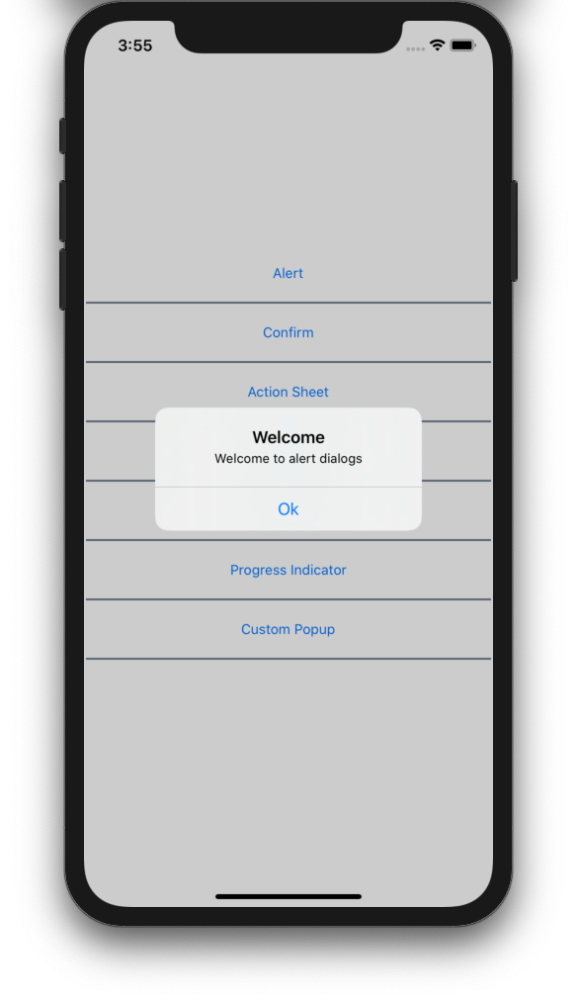
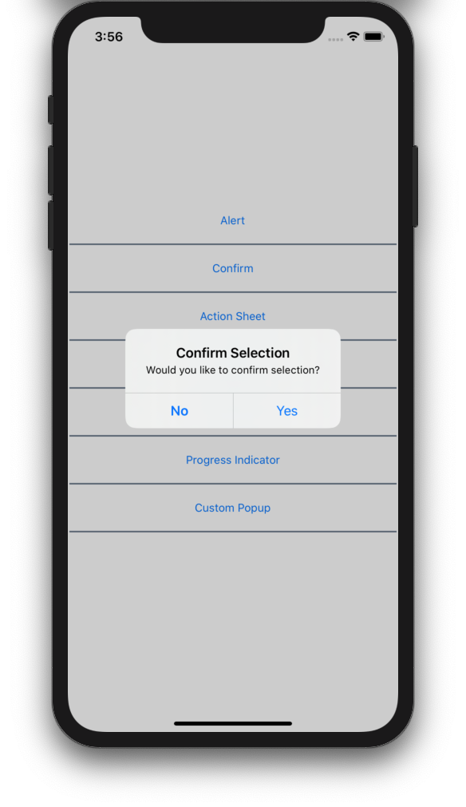
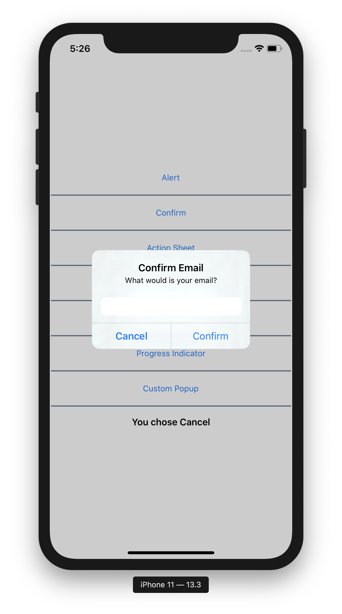
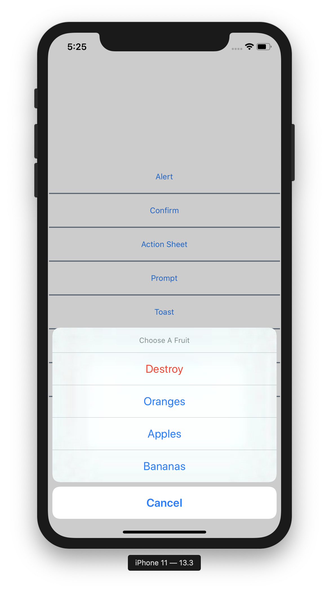
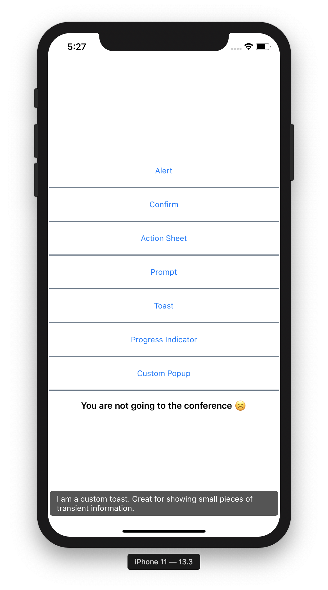
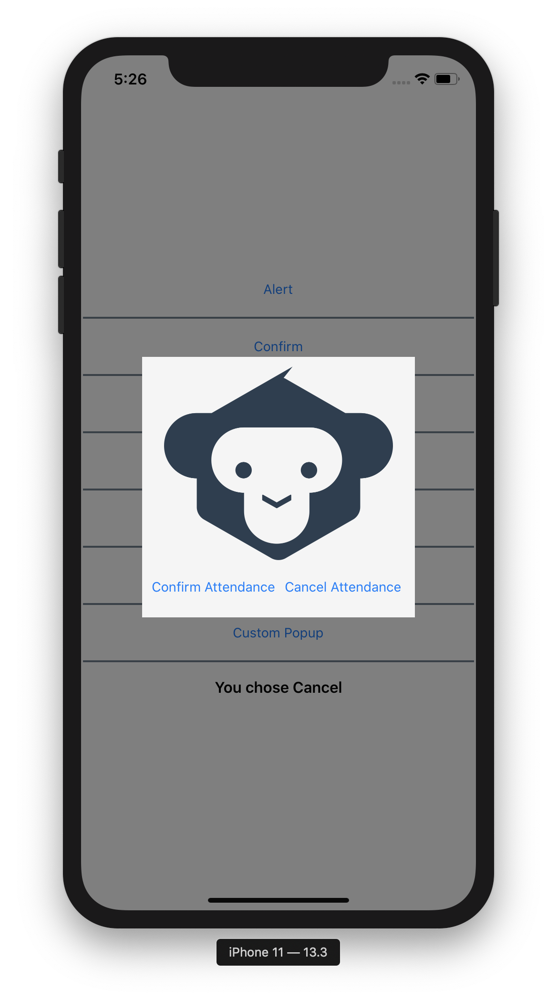

# A Beginners Guide To Dialogs In Xamarin.Forms

When developing mobile applications, dialogs are a foundational building block in our tool-belt. We can use dialogs to show a confirmation message, to indicate when the app is working or even to create a rich input form that appears over our main user interface.

This article aims to be a getting-started guide for using dialogs in Xamarin.Forms and is intended to be for beginners. I aim to introduce the core concepts and terminology, get you started with the most current dialog frameworks and provide a quick reference on the main dialog types.

If you're totally new Xamarin.Forms and want to learn about dialogs, this is the article for you 😉

Before we dive in, let's take a moment to introduce two important terms used throughout this article:

 * **Modal**: A dialog appears over the existing user interface and blocks input to the elements beneath it, not allowing users to exit by tapping outside it. Modal dialogs effectively *focus* the users attention onto the dialog.
 * **Transient**: A temporary dialog that dismisses by itself without user intervention. For example, dialogs that automatically dismiss after a specified time span are transient.

These terms, Modal and Transient, will be used many times in this article

Next, let's explore the six main dialogs kinds that we will explore in this guide:

 * [Alert](#alerts): A dialog that shows a message.
 * [Alert](#alerts): A dialog that shows a message and gives the user two options.
 * [Prompt](#prompts): A dialog that requests input from a user.
 * [Action Sheet](#action-sheets): A list of choices presented to a user.
 * [Toast](#toasts): A small, unobtrusive message that shows for a small amount of time.
 * [Progress Indicator](#progress-indicator): A dialog to indicate that our app is working.
 * [Custom Popup](#custom-popup): A modal dialog with fully customised content.

The full source code for this article can be found [here](https://github.com/mfractor/xamarin-forms.dialogs).

## Packages And Frameworks

Before we get started lets take a look at the packages we'll be using.

While Xamarin.Forms has some basic dialogs built in, we'll  be using a couple of Nuget packages to access more options.

 * Acr.UserDialogs: A rich dialogs library for Xamarin.Forms. Acr.User dialogs is the de facto standard when working with dialogs in Xamarin.Forms.
    * [Readme](https://github.com/aritchie/userdialogs);
 * Rg.Popups: Create fully customised popups and modal dialogs using Xamarin.Forms pages.
    * [Getting Start Guide](https://github.com/rotorgames/Rg.Plugins.Popup/wiki/Getting-started)

## Dialogs 101

### Alerts

An **Alert** is a modal dialog used to show a message to a user.



Alerts are a convenient way to inform the user that something has happened or that they need to make an action. They're useful when you need confirmation from the user that they have read the message.

Using Acr.UserDialogs, we would show an alert like so:

```
Acr.UserDialogs.UserDialogs.Instance.Alert("Welcome to alert dialogs", "Ok");
```

To keep concise, from now on I'll keep that Instance in field called `userDialogs`. So for the rest of the examples we can just call `userDialogs.Alert("Welcome to alert dialogs", "Ok");`.

### Confirm

A special kind of alert dialog is a **Confirm** dialog, an alert that display a message with a choice of two actions.



Presenting a Confirm Dialog is quite similar to an alert but instead you call `ConfirmAsync` and pass in another string argument for the extra button. It returns a `Task<bool>` to let you check the user's selection.

```
var result = await userDialogs.ConfirmAsync("Would you like to confirm selection?", "Confirm Selection", "Yes", "No");
```

Confirm dialogs are used ask a user to make sure something is correct before the action occurs, or to choose between two options.

### Prompts

A **Prompt** is a modal dialog that asks the user for some basic text input, such as asking for a name or email address.



**Using a prompt**

Displaying a prompt is quite similar to how we display Alerts and Confirm dialogs. The key difference being in the PromptResult that it returns, where you'll find a `bool` `Ok` to indicate if the user confirmed input and `Text` which contains the text they entered.

```
var input = await userDialogs.PromptAsync("What is your email?", "Confirm Email", "Confirm", "Cancel");

if (input.Ok)
{
   Console.WriteLine("Your email is" + input.Text);
}
```

### Action Sheets

An **Action Sheet** is a modal dialog that presents the user with a selection of choices and, optionally, a cancel and destructive action.

These are typically used when there are multiple actions a user might want to take. An example would be in an email application if a user clicks on an email they may want to Open, Forward, Reply, etc. In this case the destructive action would be **Delete** which would be displayed in red and separated from the rest of the list, hinting to the user that this action is serious and that they should think carefully. The **Cancel** option is also displayed differently to make it obvious that it is different to the other choices, this would generally



To display an ActionSheet, we'll need a list of choices and then we call `userDialogs.ActionSheetAsync()`.

```
var choices = new [] { "Oranges", "Apples", "Bananas" };

var choice = await userDialogs.ActionSheetAsync("Choose A Fruit", "Cancel", "Destroy", CancellationToken.None, choices);

if (!string.IsNullOrEmpty(choice))
{
   Message = "You chose " + choice;
}
else
{
   Message = "Action sheet was cancelled";
}
```

If you don't want a Cancel button or Destructive action you can pass `null` instead of a string for these parameters.

### Toasts

A **Toast** is a small, temporary popup that shows at the bottom of the screen useful for display displaying small and unobtrusive messages. Toasts are effectively transient dialogs.



A good example of when to use a toast is to notify the user that their data has been saved successfully.

Displaying a Toast is once again done using userDialogs, but this time calling the Toast method. As there is no title or dismiss button we only need one string input for the text to display.
```
userDialogs.Toast("I am a toast. Great for showing small pieces of transient information.");
```

### Progress Indicator

A **Progress** indicator is similar to the built in activity indicator, the key difference being that it keeps the user updated on the progress throughout the task instead of simply indicating that something is happening.


Here I'm updating progress using a loop with a delay of 20ms, in a real app you would update this based on how much work had been done and what was remaining.

```
using (var progress = userDialogs.Progress("Loading..."))
{
   for (var i = 0; i < 100; i++)
   {
         progress.PercentComplete = i;

         await Task.Delay(20);
   }
}
```

### Custom Popup

All the dialogs we've looked at so far have a fixed layout and serve a specific purpose. With a custom **Popup** you can put any content you want inside with any appearance. These are useful if you want more advanced interaction or if you want it styled to match your app instead of the system UI.

Custom popup take a bit more work than the others, for this example we'll show a popup with an image and two buttons.



The first step is to create a new Xaml ContentView called CustomPopup, this will give you a `CustomPopup.xaml` and a `CustomPopup.xaml.cs`. Instead of using ContentView as the base class, we'll swap the element to be a `popups:PopupPage` which will allow us to use it as a popup.

Inside the PopupPage we can put any Xamarin.Forms content we like. Here I've got a `Grid` that contains an `Image` and two `Button`s.
```
<?xml version="1.0" encoding="UTF-8"?>
<popups:PopupPage xmlns:x="http://schemas.microsoft.com/winfx/2009/xaml"
    xmlns="http://xamarin.com/schemas/2014/forms"
    x:Class="DialogsExamples.CustomPopup"
    CloseWhenBackgroundIsClicked="False"
    xmlns:popups="clr-namespace:Rg.Plugins.Popup.Pages;assembly=Rg.Plugins.Popup"
    xmlns:controls="clr-namespace:DialogsExamples.Controls">
    <Grid HorizontalOptions="Center" VerticalOptions="Center" Padding="10" BackgroundColor="WhiteSmoke">
       <Grid.RowDefinitions>
           <RowDefinition Height="Auto"/>
           <RowDefinition Height="Auto"/>
        </Grid.RowDefinitions>
        <Grid.ColumnDefinitions>
            <ColumnDefinition Width="*"/>
            <ColumnDefinition Width="*"/>
        </Grid.ColumnDefinitions>
        <Image Grid.Row="0" Grid.Column="0" Grid.ColumnSpan="2" Source="monkeyfest"/>
        <Button Grid.Row="1" Grid.Column="0" Text="Confirm Attendance" Clicked="ConfirmAttendanceClicked"/>
        <Button Grid.Row="1" Grid.Column="1" Text="Cancel Attendance" Clicked="CancelAttendanceClicked"/>
    </Grid>
</popups:PopupPage>
```

In the code behind we'll need a constructor that takes in an `Action`, and methods for **Confirm** and **Cancel**.

```
public partial class CustomPopup : PopupPage
{
   private readonly Action<bool> setResultAction;

   public void CancelAttendanceClicked(object sender, EventArgs e)
   {
      setResultAction?.Invoke(false);
      this.Navigation.PopPopupAsync().ConfigureAwait(false);
   }

   public void ConfirmAttendanceClicked(object sender, EventArgs e)
   {
      setResultAction?.Invoke(true);
      this.Navigation.PopPopupAsync().ConfigureAwait(false);
   }

   public CustomPopup(Action<bool> setResultAction)
   {
      InitializeComponent();
      this.setResultAction = setResultAction;
   }       
}
```

With these methods we can create a our custom popup and display it with the true/false result being passed to a callback. This code is a little messy and if we're using this code in multiple places in the app it's a bit of a pain. instead we can add a static method to CustomPopup which makes it much neater to call from other classes.

```
public static async Task<bool> ConfirmConferenceAttendance(INavigation navigation)
{
   TaskCompletionSource<bool> completionSource = new TaskCompletionSource<bool>();

   void callback(bool didConfirm)
   {
         completionSource.TrySetResult(didConfirm);
   }

   var popup = new CustomPopup(callback);

   await navigation.PushPopupAsync(popup);

   return await completionSource.Task;
}
```

This wraps up the callback in an awaitable `Task<bool>` so you don't have to worry about actions. Now when we want to display the `CustomPopup`, it feels a lot more like how we displayed the other dialogs.

```
var result = await CustomPopup.ConfirmConferenceAttendance(navigation);
```

## Summary
All of these dialogs are similar but have slight variations based on what you need to present and what input you need from the user.

As a quick guide for deciding which to pick, consider which situation best describes your needs:

**I want to display some text and have the user acknowledge the message**
 * Use an [Alert](#alerts)

**I want to get some short text input from a user**
* Use a [Prompt](#prompts) dialog.

**I want to display some text to a user but no interaction is needed**  
* Use a [Toast](#toasts)

**I want to ask the user a question with two options such as yes/no or confirm/cancel**
* Use a [Confirm](#confirm) dialog

**I want to ask to present the user with multiple options**
* Use an [Action Sheet](#action-sheets)

**I want to let the user know how much of a job has been completed**
* Use a [Progress Indicator](#progress-indicator)

**I want complete control of the content and style of my dialog**
* Use a [Custom Popup](#custom-popup)


These libraries are both free and Open Source but they rely on the support of their users. If you find UserDialogs to be useful in your project please sponsor Allan Ritchie through his [github sponsor page](https://github.com/sponsors/aritchie).

If you like Rg.Popup visit the github repo for more information [https://github.com/rotorgames/Rg.Plugins.Popup](https://github.com/rotorgames/Rg.Plugins.Popup)
